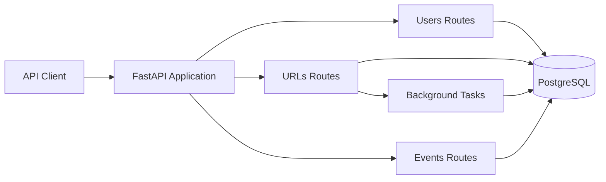
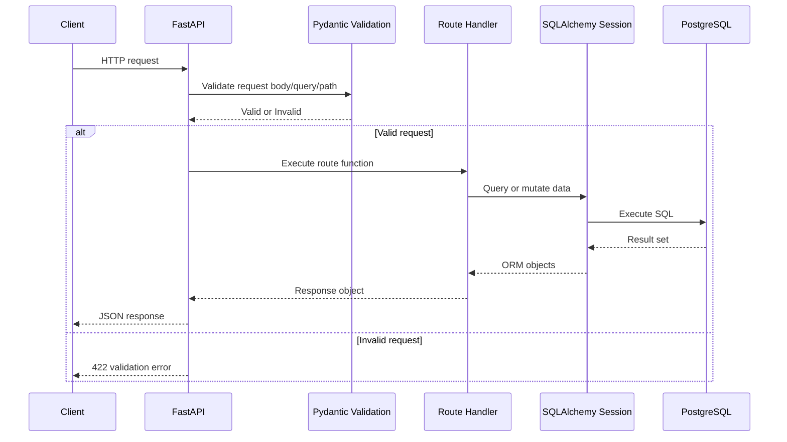
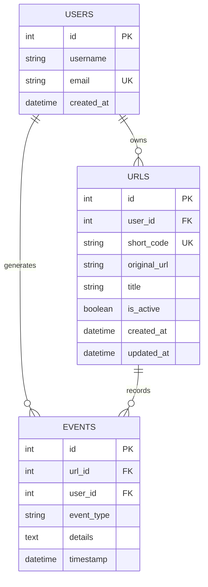
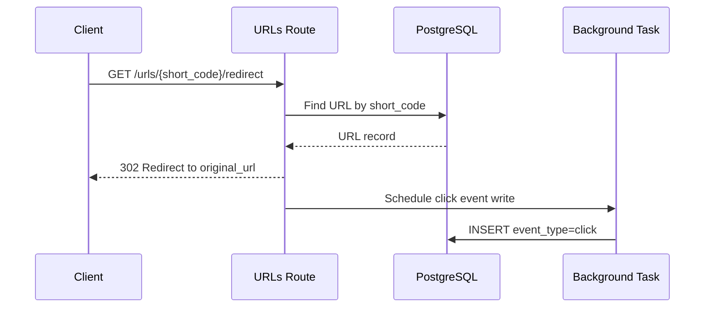

# Architecture and API Diagrams

This page provides architecture and flow diagrams for the core service foundations domain.

## 1. System Component Diagram

## 2. Request Lifecycle Sequence

## 3. Data Model ER Diagram

## 4. URL Redirect Event Flow

