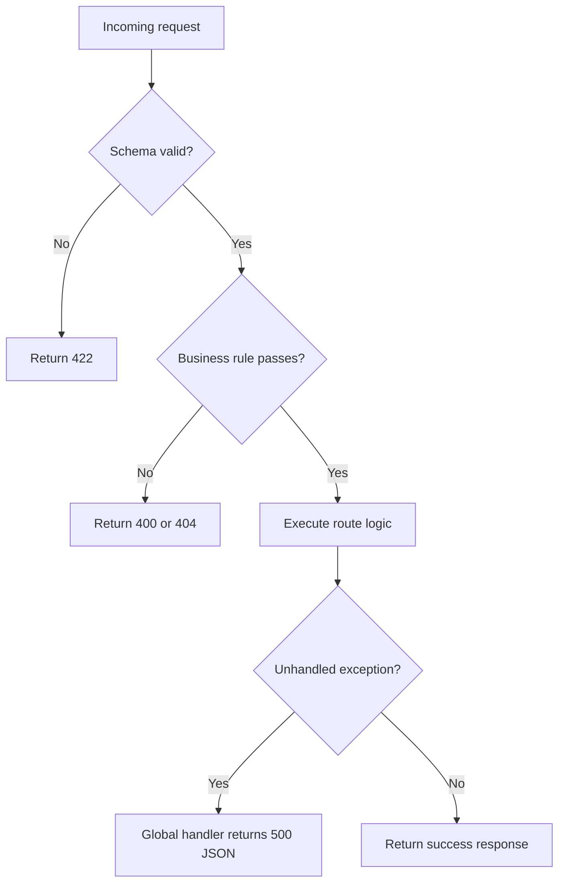
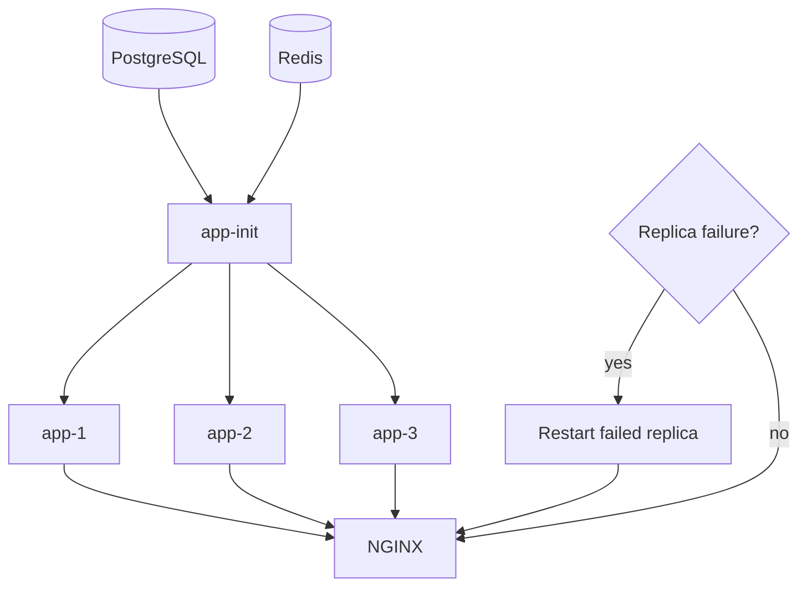
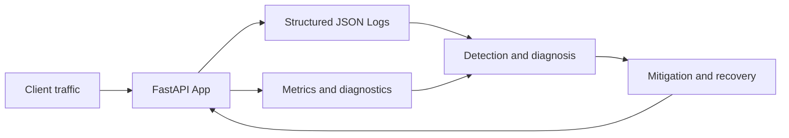
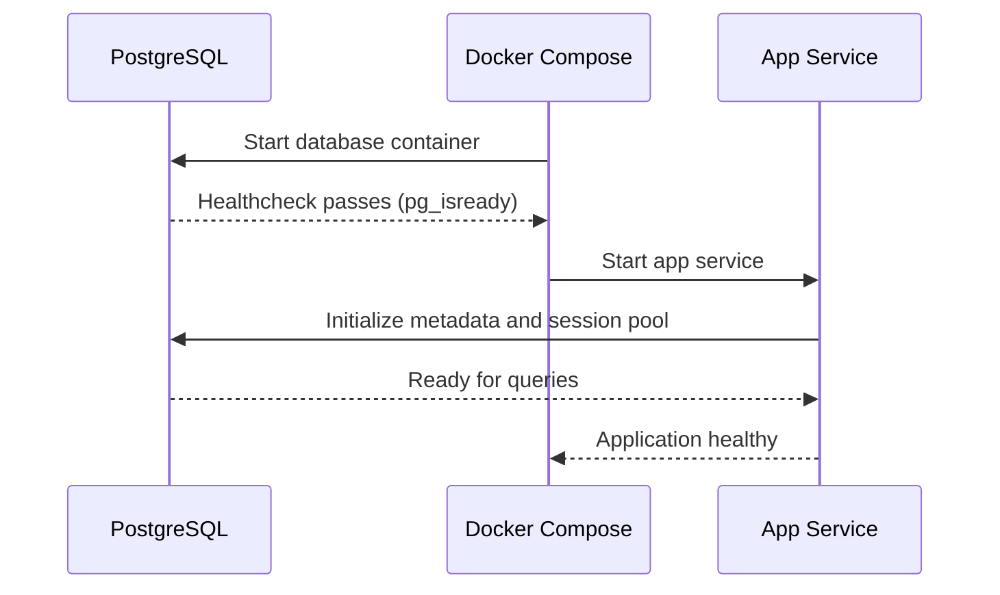

# Reliability Diagrams

This page contains reliability-focused diagrams: error handling, recovery, and observability loops.

## 1. Error Handling Decision Flow

## 2. Fleet Startup and Recovery Flow

## 3. Reliability Observability Feedback Loop

## 4. Dependency Health Startup Flow

