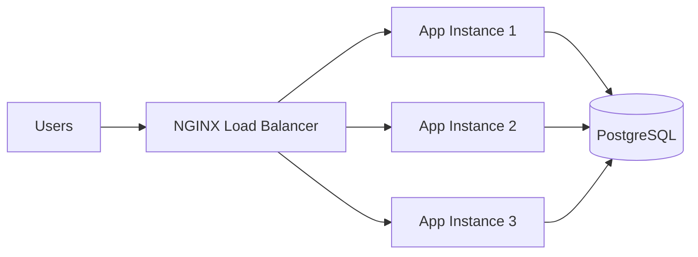
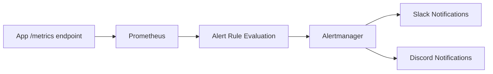
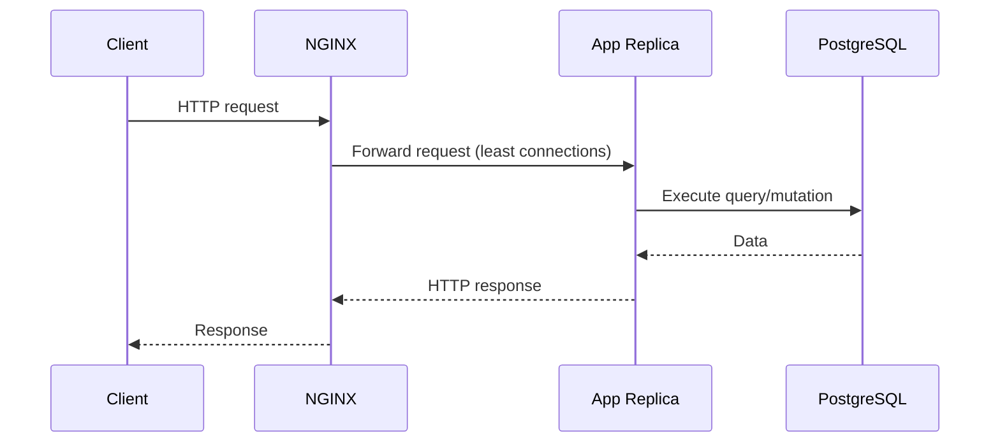

# Scalability and Monitoring Diagrams

This page visualizes scale-out architecture, load testing progression, and monitoring pipelines.

## 1. Horizontal Scaling Architecture

## 2. Monitoring and Alert Pipeline

## 3. Load Test Stage Timeline

```mermaid
gantt
  title k6 Load Profile Comparison
  dateFormat X
  axisFormat %Ls
  section Bronze
  Ramp up to 50 VUs :b1, 0, 10
  Hold 50 VUs :b2, 10, 20
  Ramp down :b3, 30, 5
  section Silver
  Ramp up to 200 VUs :s1, 0, 10
  Hold 200 VUs :s2, 10, 20
  Ramp down :s3, 30, 5
```

## 4. Request Path Through Load Balancer

